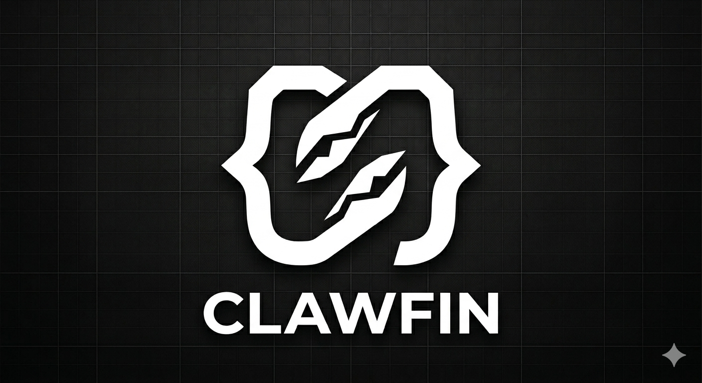
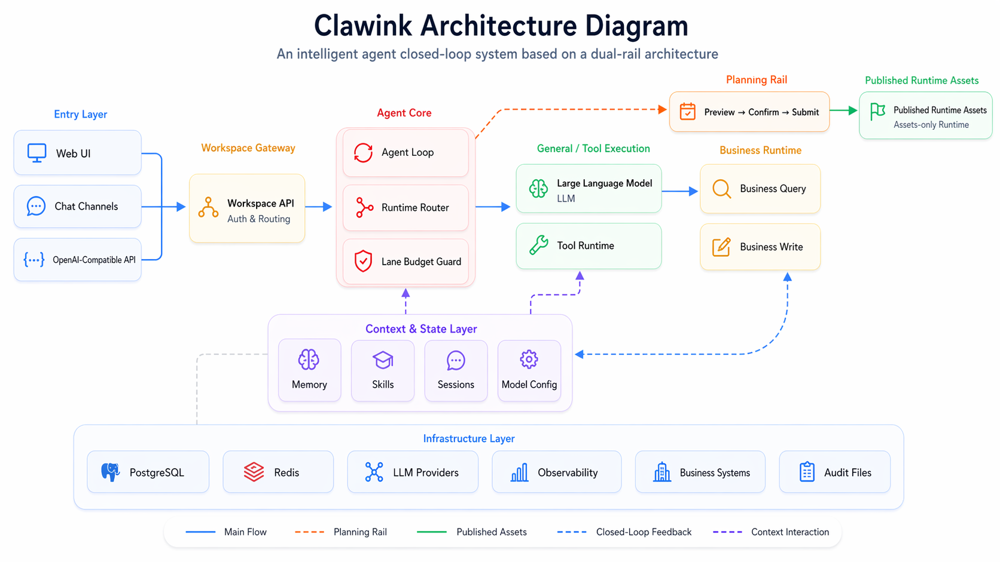

  

  <strong>Clawink — OpenClaw for Business Systems</strong> 
  Convierte sistemas de negocio complejos en una capa de producto operable por IA.

  Conecta tu sistema · Publica capacidades ejecutables · Deja que la IA planifique, previsualice, confirme y ejecute trabajo real

  
  
  

  <a href="README.md">English</a> ·
  <a href="README_zh-CN.md">中文</a> ·
  <a href="README_ja.md">日本語</a> ·
  <a href="README_ko.md">한국어</a> ·
  <a href="README_es.md">Español</a>

  <a href="#why-clawink-es">Por qué Clawink</a> ·
  <a href="#architecture-es">Arquitectura</a> ·
  <a href="#status-es">Estado actual</a> ·
  <a href="#roadmap-es">Hoja de ruta</a> ·
  <a href="#community-es">Comunidad</a>

---

## Por qué Clawink

La mayoría de los sistemas de negocio no fallan por falta de funciones. Fallan por la fricción de uso.

Los usuarios suelen tener que entender menús, flujos, permisos y reglas operativas antes de poder aprovechar realmente el sistema. Clawink no pone otra interfaz de chat encima de esa complejidad. Organiza la capacidad del sistema como una capa operable por IA para que la gente pase de "primero aprender el sistema" a "expresar directamente el objetivo".

Clawink se apoya en dos líneas coordinadas:

- Línea de planificación: lee documentación, estructura capacidades, propone flujos, los valida y publica activos listos para runtime.
- Línea conversacional: consume solo activos ya publicados durante la conversación y no recompone toda la capacidad en cada mensaje.

Por eso Clawink no es solo una carcasa de chat. Es una capa operativa para sistemas de negocio reales.

## Arquitectura

La línea de planificación genera activos revisados. La línea de ejecución usa solo activos publicados y ejecuta bajo reglas de previsualización, confirmación y control operativo.

  

## Estado actual

Este repositorio es la vista previa pública de Clawink.

- Por ahora publica solo la visión del producto, la arquitectura, la hoja de ruta y los recursos de marca.
- El runtime principal y el código del producto siguen en el repositorio interno mientras el modelo del producto termina de estabilizarse.
- La liberación pública del código llegará por etapas mediante una sincronización unidireccional desde el repositorio interno.

En otras palabras, Clawink avanza hacia el código abierto, pero este repositorio todavía no es la liberación pública completa.

## Hoja de ruta

La apertura del proyecto se plantea en cuatro etapas:

1. Vista previa pública: README, arquitectura, hoja de ruta y recursos de marca.
2. Núcleo público: módulos seleccionados de runtime, empaquetado y flujo mínimo para desarrolladores.
3. Superficie de extensión pública: algunos Skills, ejemplos de integración y documentación para extensiones externas.
4. Apertura más amplia: ampliar gradualmente los módulos públicos y reforzar CI y colaboración comunitaria.

Consulta [ROADMAP.md](ROADMAP.md) para ver el plan actual.

## Comunidad

- Sigue el repositorio para enterarte de los hitos de apertura.
- Usa Issues y Discussions para compartir escenarios, necesidades de integración y feedback.
- Antes de planificar una adopción real, toma como referencia la hoja de ruta y las publicaciones oficiales.
