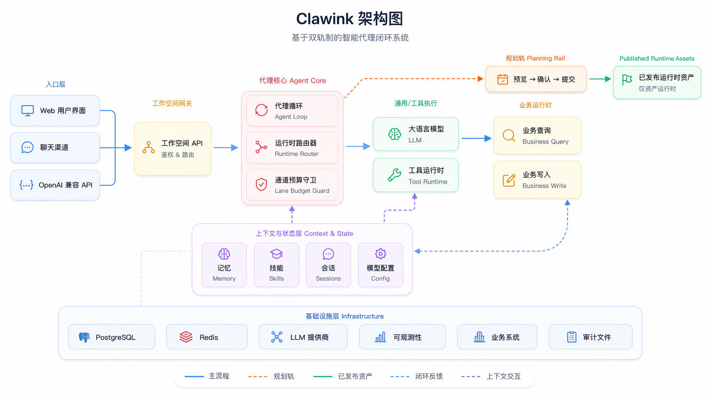

  

  <strong>Clawink — OpenClaw for Business Systems</strong> 
  把复杂业务系统升级为 AI 可理解、可规划、可执行的产品层。

  接入你的系统 · 发布可执行能力 · 让 AI 规划、预览、确认并执行真实业务

  
  
  

  <a href="README.md">English</a> ·
  <a href="README_zh-CN.md">中文</a> ·
  <a href="README_ja.md">日本語</a> ·
  <a href="README_ko.md">한국어</a> ·
  <a href="README_es.md">Español</a>

  <a href="#why-clawink-zh">为什么是 Clawink</a> ·
  <a href="#highlights-zh">特色速览</a> ·
  <a href="#architecture-zh">架构图</a> ·
  <a href="#from-connection-to-control-zh">从接入到接管</a> ·
  <a href="#teams-and-scenarios-zh">适用团队</a> ·
  <a href="#status-zh">当前状态</a> ·
  <a href="#roadmap-zh">开放路线</a> ·
  <a href="#community-zh">社区参与</a>

---

## 为什么是 Clawink

大多数业务系统真正的问题，不是能力不够，而是使用门槛太高。

用户往往要先理解菜单、流程、权限和操作规则，系统能力才真正用得起来。Clawink 要做的，不是在复杂系统外面再包一层聊天界面，而是把系统能力整理成 AI 可以稳定理解、规划和执行的操作层，让用户从“先学系统”切换为“直接说目标”。

Clawink 的核心机制建立在两条打通但分离的主链上：

- 规划线：读取文档、识别能力、生成工作流草稿、校验并发布运行时可用资产。
- 对话运行线：只消费已发布资产，不在用户发消息时临场重建整套能力。

正因为这两条主链是分离的，Clawink 才不是简单的聊天壳，而是面向真实业务系统的 AI 操作层。

## 特色速览

如果你想先抓住 Clawink 最关键的差异，可以先看这三点：

<table>
  <tr>
    <td valign="top" width="33%">
      <strong>双主链设计</strong> 
      规划线负责沉淀和发布运行时可用资产，对话运行线只消费已发布资产，不在会话现场临时拼装整套能力。
    </td>
    <td valign="top" width="33%">
      <strong>快速接管现有系统</strong> 
      不需要从零重做 AI 产品层，把 Clawink 接入现有系统，就能更快继承 OpenClaw 的核心机制与扩展体系。
    </td>
    <td valign="top" width="33%">
      <strong>执行可控可观测</strong> 
      高风险操作统一走 `preview -> confirm -> submit`，同时保留执行链路、预算命中、工具调用和结果回看能力。
    </td>
  </tr>
</table>

## 架构图

规划侧负责沉淀和发布资产，运行侧只执行已经发布的能力，并在预览、确认和运行约束下完成真实操作。

  

## 从接入到接管

1. **接入系统**：导入 Swagger / OpenAPI / Markdown，补齐授权，让 Clawink 真正拿到系统能力。
2. **沉淀能力**：把接口、页面动作和业务依赖规划成工作流与能力资产，并发布为运行时可用目录。
3. **交给 AI 执行**：用户直接对话下达业务目标，Clawink 负责路由、预览、确认、执行和结果返回。

## 你真正得到的能力

- **一个可以接管业务系统的 AI 工作台**：系统接入、任务规划、运行时执行、授权、观测和治理都在同一条主链里完成。
- **一个可以直接服务终端用户的 AI 产品层**：用户描述目标，Clawink 负责把目标落成查询、执行和结果返回。
- **一个对业务团队友好的运营控制台**：规划结果不是一次性的 prompt 结果，而是工作流、能力资产、发布状态、执行日志这类可持续运营的资产。
- **一个对技术团队友好的稳定底座**：系统可以持续扩展、切换模型、补充 Skill、增加 MCP，而不用把主链推倒重来。

## 适用团队与场景

- **产品团队**：想把传统后台、内部系统或 SaaS 产品升级成真正可对话、可执行的 AI 产品。
- **体验复杂的系统团队**：想让用户不再学习复杂菜单、页面流转和操作规则，而是直接表达业务目标。
- **平台与集成团队**：想把多个系统、多个管理端、多个 API 入口收敛成统一 AI 操作入口。
- **执行型产品团队**：想让 AI 不只负责“解释系统”，还能够稳定查询、预览、确认和执行系统动作。
- **交付与治理团队**：想在 AI 执行业务任务时，依然保留风险控制、授权管理、执行观测和审计能力。

## 当前状态

当前仓库是 Clawink 的公开预览仓。

- 目前只公开产品介绍、架构图、开放路线和品牌素材。
- 核心运行时代码与产品代码仍保留在私有主仓，等待产品机制进一步稳定。
- 后续代码开放会通过“私有主仓 -> 公开仓”的单向同步方式分阶段发布。

这意味着 Clawink 正在走向开源，但当前仓库还不是完整代码开源版。

## 开放路线

当前的开放计划分为四个阶段：

1. 公开预览阶段：只发布 README、架构、路线图和品牌素材。
2. 核心能力开放：择机开放部分运行时模块、打包结构和最小开发流程。
3. 扩展能力开放：逐步开放部分 Skill、集成示例和外部扩展文档。
4. 更完整的开源版本：逐步扩大公开模块范围，并完善 CI 与社区协作路径。

详细计划见 [ROADMAP.md](ROADMAP.md)。

## 社区参与

- 关注仓库，跟踪公开发布节点。
- 通过 Issues 或 Discussions 提交场景需求、接入诉求和反馈。
- 当前阶段的协作方式见 [CONTRIBUTING.md](CONTRIBUTING.md)。
- 安全问题请按 [SECURITY.md](SECURITY.md) 中的私下报告方式处理。
- 在正式代码开放前，请以路线图和公开说明为准评估接入计划。
